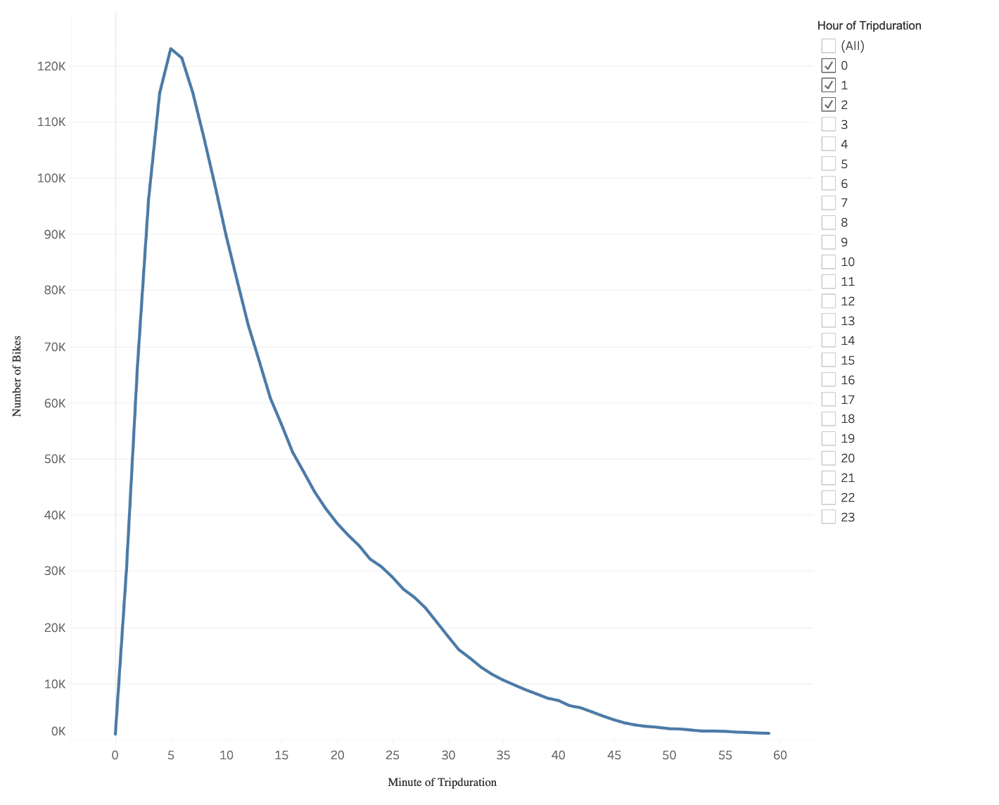
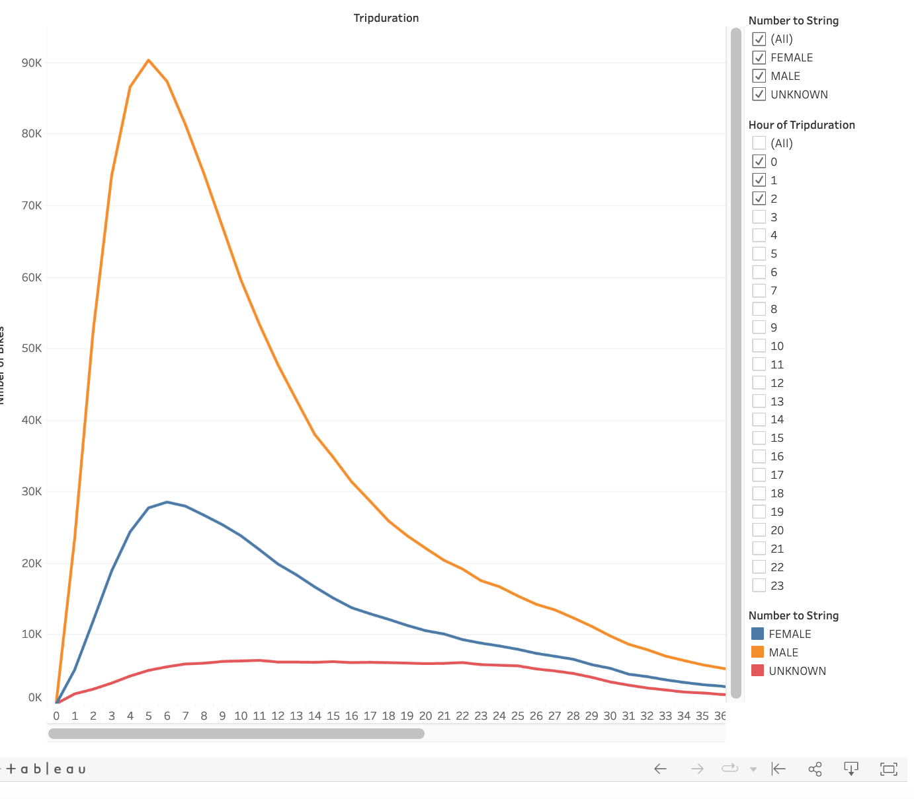
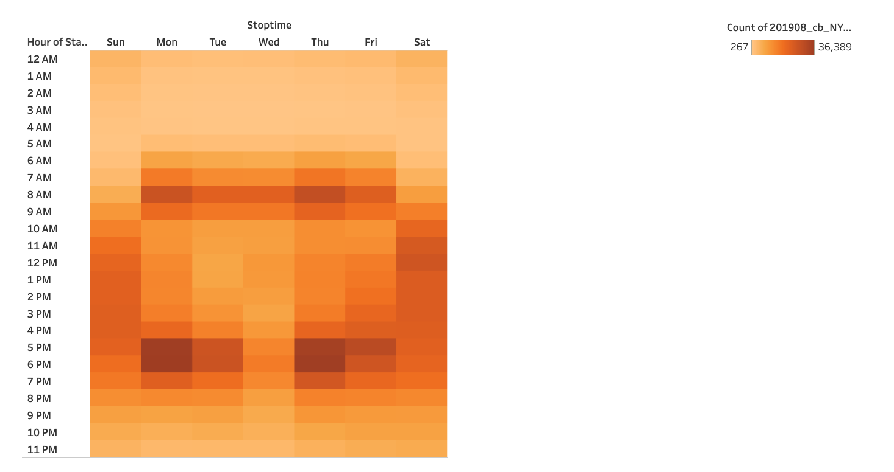
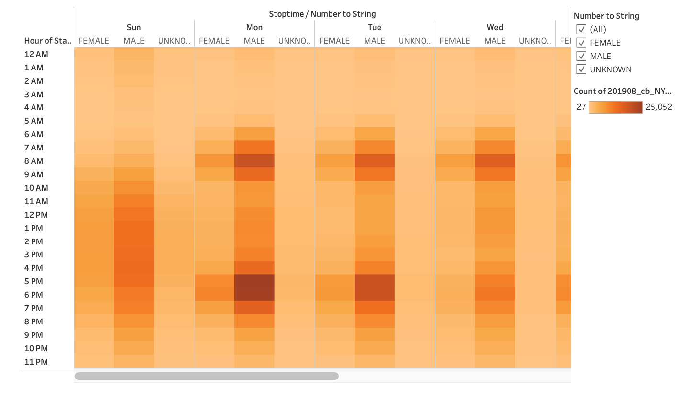
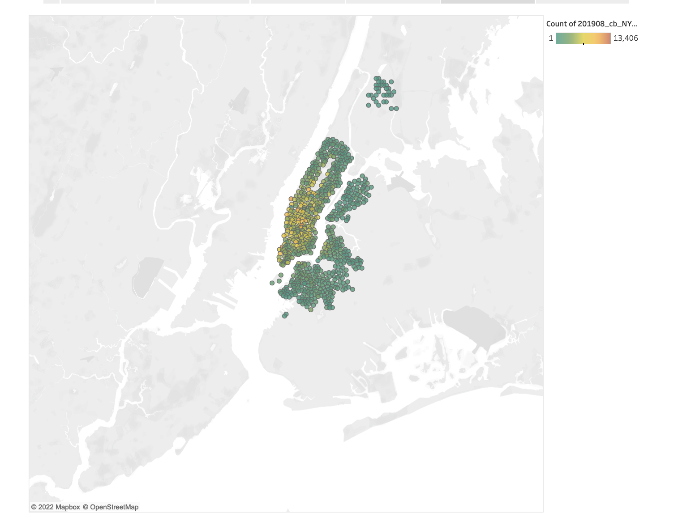
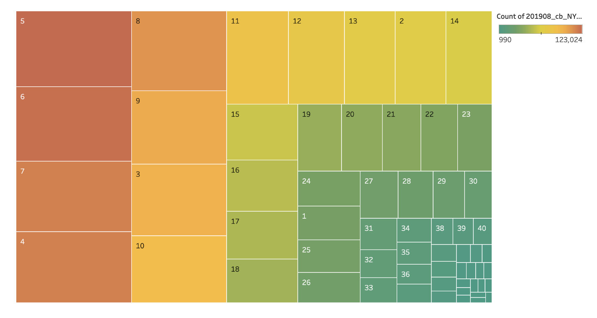

# Citi BikeSharing

Tableau Story can be found below:
[https://public.tableau.com/app/profile/erika.wolf/viz/Challenge14_16682342268070/Biksharing?publish=yes](https://public.tableau.com/app/profile/erika.wolf/viz/Challenge14_16682342268070/Biksharing?publish=yes "link to dashboard")

https://public.tableau.com/app/profile/erika.wolf/viz/Challenge14_16682342268070/Biksharing?publish=yes

## Overview
This analysis was created to analyze New York CitiBike data for investors to be informed before beginning a bikeshare program elsewhere. This analysis can be used to answer some of the questions below:
  - Who uses the CitiBikes?
  - What New York areas see the most bikeshare use?
  - What time are bikes used?
  - How long are trips?

## Results
### Minutes by Trip Duration

The vast majority of trips are under an hour in length. 

### Checkout by Gender

Men are checking out far more bikes than women or unknown users are. 

### Trips by Weekday & Hour

Sundays and Saturdays are the overall busiest days that bikes are being used. 7am-9am and 5pm-7pm are the busiest checkout times during the week. 

### Trips by Gender

Men are taking more trips on the bikes than women, any day of the week. 

### Trips by Gender and Weekday

Customers, regardless of gender, take about the same amount of trips, regardless of weekday. Men seem to be subscribed more to the bikeshare program than women, and they consistenly take more trips than either women or unknown subscribers, any day of the week. 

### Start Station Count

We can see here that there are certain bike stations that are favored by riders to start their trips. 

### Trip Duaration in Minutes

We can see that the vast majority of trips last between 4 and 8 minutes.

## Summary
Bikeshare programs are popular in areas where public transportation is not always feasible, and where individuals do not want to own or drive cars. The majority of users are men, and the majority of those men are subscribed to the bikeshare programs. Citibike can take two approaches to this information: appeal more to female riders since there is so much more use by men; or Citibike can continue to attract male customers--the majority of the customer base already. 

If given more time to pursue this analysis, I would ask the following questions:
  - Does age or gender impact where, when, and how long bikes are rented?
  - What local attractions are determining the busiest start and ending locations of the bikes?

